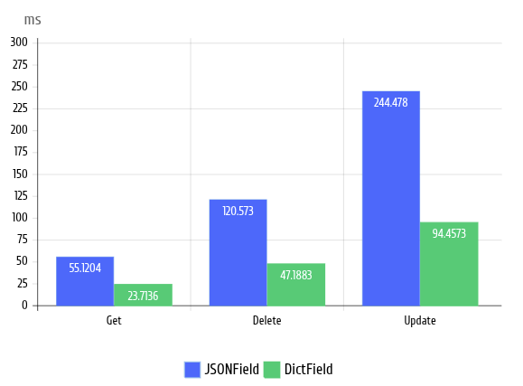

# django-dto-field

[](https://pypi.org/project/django-dict-field/)
[](https://pypi.org/project/django-dict-field/)
[](https://pypi.python.org/pypi/django-dict-field/)
[](https://github.com/wemake-services/wemake-python-styleguide)
[](https://github.com/skv0zsneg/django-dict-field/actions/workflows/test.yml)
[](https://github.com/skv0zsneg/django-dict-field/actions/workflows/typing_and_lint.yml)

Storing DTO data in Django model field with fast [de]serialization.

## ✨ Features

- [ ] Faster than [JSONField](#-benchmarks) wrappers
- [X] All DB support (if DB support BinaryFiled)
- [ ] Zip field for size saving (optional)
- [X] Supports pure `dict` as DTO
- [ ] Supports `TypedDict` as DTO
- [ ] Supports `dataclass` as DTO
- [ ] Supports `pydantic` as DTO
- [ ] Supports `marshmallow` as DTO
- [ ] Supports `attrs` as DTO
- [ ] Supports `adapdtix` as DTO


## ⬇️ Install

```bash
$ pip install django-dto-field
```

## 🚀 Quick start

Set dto field to your model

```python
>>> from django.db.models import CharField
>>> from django_dto_field import DtoField

>>> class Country(Model):
...    name = CharField()
...    city = DtoField()
```

And than use it as usual

```python
>>> from dataclasses import dataclass

>>> @dataclass  # <- Change to your favorite DTO
... class City:
...    name: str 
...    districts: list[str]

>>> city = City(name="Capitol", districts=[f"d{i}" for i in range(1, 14)])
>>> country = Country.objects.create(name="Panem", city=city)

>>> assert isinstance(country.city, City)
```

## 📊 Benchmarks 

Sometimes we need to store some key value data in storages. Often it also need to be efficient for work with big data and have some validation and another features.

`django-dto-field` is a tool build around amazing [msgspec](https://github.com/jcrist/msgspec) serialization and validation library for solving this problems like a charm ✨

**DtoField vs JSONField Benchmark**

Operations on 100 000 size dict on PostgreSQL DB. Script [here](/benchmarks/jsonfield_benchmark.py).




## 🤗 Author

Made with love by [@skv0zsneg](https://github.com/skv0zsneg)
